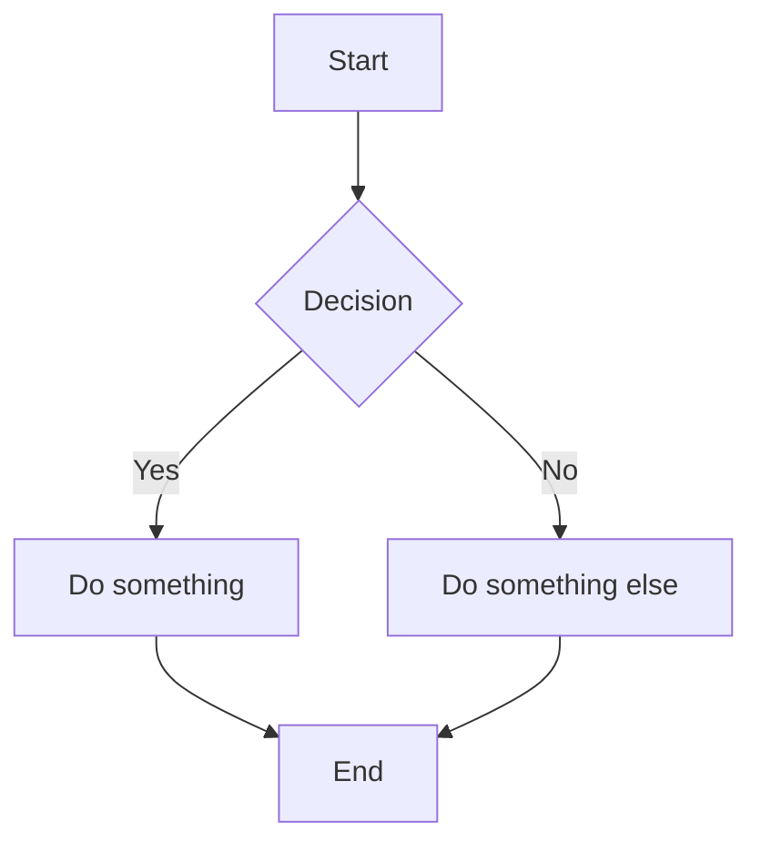

# Gitsidian

**Git-native personal knowledge management.** An Obsidian-inspired desktop app where your notes are just files in a Git repository—no proprietary sync, no cloud lock-in, full version history for free.

Built with **Tauri 2 + React 19 + CodeMirror 6 + Rust**.

---

## Table of Contents

- [Features](#features)
- [Prerequisites](#prerequisites)
- [Installation](#installation)
- [Running the App](#running-the-app)
- [Building for Production](#building-for-production)
- [Getting Started](#getting-started)
- [Editor](#editor)
- [Keyboard Shortcuts](#keyboard-shortcuts)
- [Markdown Syntax](#markdown-syntax)
- [Wikilinks](#wikilinks)
- [Daily Notes](#daily-notes)
- [Templates](#templates)
- [Tags](#tags)
- [Properties (Frontmatter)](#properties-frontmatter)
- [Git Integration](#git-integration)
- [Search](#search)
- [Graph View](#graph-view)
- [Right Panel](#right-panel)
- [Tech Stack](#tech-stack)
- [Project Structure](#project-structure)
- [License](#license)

---

## Features

- **Live WYSIWYG preview** — headings, bold, italic, strikethrough, highlights, images, and more render inline as you type. Click a line to edit its raw markdown.
- **Full Git integration** — stage, commit, push, pull, branch, and view file history without leaving the app.
- **Wikilinks** (`[[note]]`) — link between notes. Autocomplete triggers when you type `[[`. Hover to preview linked notes.
- **Backlinks panel** — see every note that links to the current one.
- **Graph view** — visualize your knowledge graph with Cytoscape.js.
- **Callouts / Admonitions** — `> [!note]`, `> [!warning]`, `> [!tip]`, etc. Renders with colored borders and icons.
- **Math rendering** — inline `$LaTeX$` and block `$$...$$` powered by KaTeX.
- **Mermaid diagrams** — fenced ` ```mermaid ` blocks render as interactive diagrams.
- **Note embedding** — `![[note-name]]` transcludes another note's content inline.
- **Markdown preview pane** — toggle between source editor and full rendered preview.
- **Interactive checkboxes** — `- [ ]` / `- [x]` render as clickable checkboxes.
- **Daily notes** — one-click or `Alt+D` to create/open today's daily note.
- **Templates** — create a `templates/` folder, then insert template content with variable substitution.
- **Tags** — `#tag` extraction from content and YAML frontmatter, browsable in sidebar.
- **Properties editor** — visual key-value editor for YAML frontmatter.
- **Command palette** — `Ctrl+P` fuzzy search across all notes, or create a new one.
- **File management** — drag & drop, right-click context menus, rename, delete, star notes.
- **Auto-save** — changes are automatically saved after 2 seconds of inactivity.
- **Image paste** — paste images from your clipboard directly into a note. Saved to `attachments/` and inserted as markdown.
- **Table rendering** — markdown tables render in the preview pane with alignment support.
- **Safe delete & close** — confirmation dialogs when deleting files or closing unsaved tabs.
- **Full-text search** — powered by Tantivy on the Rust backend.
- **File watching** — automatic refresh when files change on disk.
- **Dark theme** — Catppuccin Mocha color scheme throughout.

---

## Prerequisites

| Tool | Version | Notes |
|------|---------|-------|
| **Node.js** | 18+ | [nodejs.org](https://nodejs.org) |
| **Rust** | 1.77+ | [rustup.rs](https://rustup.rs) |
| **Visual Studio Build Tools** | 2022 | Windows only — install "Desktop development with C++" workload |

> **Windows users**: Make sure you're using the MSVC toolchain. Run `rustup default stable-x86_64-pc-windows-msvc` if needed.

---

## Installation

```bash
# Clone the repository
git clone https://github.com/your-username/gitsidian.git
cd gitsidian

# Install frontend dependencies
npm install
```

No extra Rust setup is needed—Cargo handles backend dependencies automatically on first build.

---

## Running the App

```bash
# Development mode (hot-reload)
npx tauri dev
```

This launches both the Vite dev server (port 5173) and the Tauri window. Changes to React code hot-reload instantly; Rust changes trigger a recompile.

---

## Building for Production

```bash
# Build optimised native binary
npx tauri build
```

The installer/executable will be in `src-tauri/target/release/bundle/`.

---

## Getting Started

1. **Launch the app** — you'll see the Welcome screen.
2. **Open a vault** — click "Open Vault" and select any folder. If it's a Git repo, Git features activate automatically. If not, you can initialise one from the Git panel.
3. **Create your first note** — click the `+` button in the file tree sidebar, or press `Ctrl+P` and type a name.
4. **Start writing** — the editor supports full Markdown with live inline rendering.

---

## Editor

The editor is built on CodeMirror 6 with a suite of custom extensions:

### Source Mode (default)
The live WYSIWYG editor. Markdown syntax renders inline:
- **Headings** display at their actual size (H1 is large, H6 is small). `#` markers fade out when the cursor leaves the line.
- **Bold**, *italic*, ~~strikethrough~~, and ==highlights== render inline.
- `Inline code` renders with a monospace background.
- Images render below their line.
- Horizontal rules render as styled dividers.
- Blockquotes get a blue left border.

Move your cursor to any line to reveal and edit the raw Markdown.

### Preview Mode
Press **Ctrl+E** or click the 👁 button in the tab bar to switch to a fully rendered read-only preview. Supports everything in source mode plus full HTML rendering of callouts, math, Mermaid diagrams, and more.

### Tabs
- Click a file in the sidebar to open it in a new tab.
- Click a tab to switch to it. Unsaved tabs show a `●` indicator.
- Click `×` to close a tab.

---

## Keyboard Shortcuts

| Shortcut | Action |
|----------|--------|
| `Ctrl+S` | Save current file |
| `Ctrl+P` | Open command palette (fuzzy note search) |
| `Ctrl+B` | Toggle right panel |
| `Ctrl+E` | Toggle source / preview mode |
| `Alt+D` | Open today's daily note |
| `Ctrl+Z` | Undo |
| `Ctrl+Shift+Z` | Redo |
| `Ctrl+F` | Find in file |
| `Ctrl+H` | Find and replace |
| `Tab` | Indent |
| `Shift+Tab` | Outdent |
| `Escape` | Close command palette / dialogs |

---

## Markdown Syntax

Gitsidian supports standard Markdown plus Obsidian-flavoured extensions:

### Headings
```markdown
# Heading 1
## Heading 2
### Heading 3
#### Heading 4
##### Heading 5
###### Heading 6
```

### Text Formatting
```markdown
**bold text**
*italic text*
~~strikethrough~~
==highlighted text==
`inline code`
```

### Lists
```markdown
- Unordered item
- Another item
  - Nested item

1. Ordered item
2. Another item

- [ ] Unchecked task
- [x] Completed task
```

Checkboxes are **interactive** — click them to toggle.

### Links & Images
```markdown
[Link text](https://example.com)

```

### Blockquotes
```markdown
> This is a blockquote
> It can span multiple lines
```

### Code Blocks
````markdown
```javascript
const hello = "world";
```
````

### Horizontal Rule
```markdown
---
```

### Tables
```markdown
| Left | Center | Right |
| :--- | :----: | ----: |
| A    |   B    |     C |
| D    |   E    |     F |
```
Alignments are set by colons in the separator row: `:---` left, `:---:` center, `---:` right.

### Image Paste
Paste an image from your clipboard (`Ctrl+V`) while the editor is focused. The image is saved to `attachments/pasted-<timestamp>.<ext>` inside your vault, and an `` link is inserted at the cursor.

---

## Wikilinks

Link between notes using double-bracket syntax:

```markdown
[[note-name]]
[[note-name|display text]]
```

### Features
- **Autocomplete**: Type `[[` to trigger a popup listing all notes in your vault. Keep typing to filter.
- **Click to navigate**: Click any rendered wikilink to open the linked note.
- **Hover preview**: Hover over a wikilink to see a tooltip with the first 15 lines of the linked note.
- **Auto-close brackets**: Typing `[[` automatically inserts the closing `]]`.

### Note Embedding (Transclusion)

Embed the content of another note inline:

```markdown
![[note-name]]
```

This renders the first 30 lines of the referenced note in a bordered card. Click the header to navigate to the full note.

---

## Daily Notes

Daily notes live in a `daily/` folder and are named by date (`YYYY-MM-DD.md`).

### Opening Today's Note
- Press **Alt+D** from anywhere, or
- Go to the **Daily** tab in the sidebar and click "Open Today's Note"

If the note doesn't exist yet, it's created automatically with this template:

```markdown
---
date: 2026-02-07
type: daily-note
---

# Saturday, February 7, 2026

## Tasks
- [ ] 

## Notes


## Journal

```

The sidebar also shows the last 7 days for quick access.

---

## Templates

### Setup
1. Create a `templates/` folder in your vault root.
2. Add `.md` files to it — each one is a template.

### Template Variables
Templates support these placeholders, auto-replaced when used:

| Variable | Replaced With |
|----------|---------------|
| `{{date}}` | Current date (`YYYY-MM-DD`) |
| `{{time}}` | Current time (locale format) |
| `{{datetime}}` | Full ISO datetime |
| `{{title}}` | Note title (filename without `.md`) |

### Using Templates
Go to the **Tmpl** tab in the sidebar. Each template shows two actions:
- **⎘** (Insert) — Inserts the template content at the cursor position in the current editor.
- **+** (New Note) — Creates a new note from the template with the variables filled in.

---

## Tags

### Syntax
Add tags anywhere in your note content:

```markdown
This is about #productivity and #note-taking.
```

Or in YAML frontmatter:

```yaml
---
tags: [productivity, note-taking]
---
```

### Browsing Tags
Open the **Tags** tab in the sidebar to see all tags extracted from the current note, sorted by frequency, with counts. Use the filter box to search.

---

## Properties (Frontmatter)

YAML frontmatter at the top of a note stores metadata:

```yaml
---
title: My Note
date: 2026-02-07
tags: [idea, project]
status: draft
---
```

### Visual Editor
Open the **Props** tab in the right panel to edit frontmatter as key-value pairs without touching raw YAML:
- Edit keys and values in input fields.
- Click **×** to remove a property.
- Click **+ Add property** to add a new one.
- Click **Add Properties** on notes without frontmatter to create it.

---

## Callouts / Admonitions

Obsidian-style callouts render with icons and colors:

```markdown
> [!note] This is a note
> Additional content goes here.

> [!warning] Be careful
> This is important.

> [!tip] Pro tip
> Try using templates!
```

### Supported Types

| Type | Icon | Color |
|------|------|-------|
| `note` | 📝 | Blue |
| `tip` | 💡 | Green |
| `info` | ℹ️ | Cyan |
| `warning` | ⚠️ | Yellow |
| `danger` | 🔴 | Red |
| `bug` | 🐛 | Red |
| `example` | 📋 | Purple |
| `quote` | 💬 | Grey |
| `abstract` | 📄 | Cyan |
| `todo` | ☑️ | Blue |
| `success` | ✅ | Green |
| `question` | ❓ | Yellow |
| `failure` | ❌ | Red |
| `caution` | ⚠️ | Orange |
| `important` | ❗ | Orange |

---

## Math (KaTeX)

### Inline Math
```markdown
The equation $E = mc^2$ is famous.
```

### Block Math
```markdown
$$
\int_{-\infty}^{\infty} e^{-x^2} dx = \sqrt{\pi}
$$
```

Both render in the source editor (when cursor is off the line) and in preview mode.

---

## Mermaid Diagrams

Fenced code blocks with the `mermaid` language render as diagrams:

````markdown

````

Supports flowcharts, sequence diagrams, class diagrams, state diagrams, Gantt charts, and more. See [mermaid.js.org](https://mermaid.js.org/) for full syntax.

---

## Git Integration

Gitsidian treats your vault as a Git repository. Open the **Git** tab in the sidebar to access:

### Status
See all modified, added, deleted, and untracked files with color-coded indicators.

### Staging
- Click a file to stage/unstage it.
- Use **Stage All** to stage everything.

### Committing
Type a commit message and click **Commit**.

### Branches
- View the current branch in the status bar.
- Create and switch branches from the Git panel.

### Push & Pull
- **Pull** to fetch and merge remote changes.
- **Push** to upload your commits.

### File History
Open the **History** tab in the right panel to see the full commit log for the current file. Click a commit to view the file at that point in time.

### Status Bar
The bottom status bar shows:
- Current branch name
- Count of changed / staged files
- Word count for the current note
- Unsaved indicator

---

## Search

### Quick Search (Command Palette)
Press **Ctrl+P** to fuzzy-search all note names. Type to filter, arrow keys to navigate, Enter to open. If no match exists, pressing Enter creates a new note with that name.

### Full-Text Search
Open the **Search** tab in the sidebar. Powered by Tantivy (Rust), it searches across all note content and returns results with snippets ranked by relevance.

---

## Graph View

Open the **Graph** tab in the right panel to see an interactive knowledge graph:

- **Nodes** = notes in your vault.
- **Edges** = wikilink connections between notes.
- Node size scales with backlink count.
- Click a node to open that note.
- Drag to rearrange. Scroll to zoom. The layout uses the `cose` physics algorithm.

---

## Right Panel

Toggle with **Ctrl+B**. Contains five tabs:

| Tab | Description |
|-----|-------------|
| **Outline** | Table of contents generated from headings. Click to jump to a heading. |
| **Links** | Backlinks — every note that links to the current one via `[[wikilinks]]`. |
| **Props** | Visual YAML frontmatter editor (key-value pairs). |
| **History** | Git commit log for the current file. Click to view old versions. |
| **Graph** | Interactive knowledge graph (Cytoscape.js). |

---

## Tech Stack

### Frontend
| Technology | Purpose |
|------------|---------|
| React 19 | UI framework |
| TypeScript 5 | Type safety |
| Vite 7 | Build tool + HMR |
| CodeMirror 6 | Markdown editor (10 custom extensions) |
| Cytoscape.js | Graph visualization |
| Zustand 5 | State management (3 stores) |
| KaTeX | Math rendering |
| Mermaid | Diagram rendering |

### Backend (Rust)
| Crate | Purpose |
|-------|---------|
| Tauri 2 | Desktop shell + IPC |
| git2 | Git operations (libgit2 bindings) |
| tantivy | Full-text search engine |
| comrak | Markdown parsing |
| notify | File system watching |
| tokio | Async runtime |
| walkdir | Directory traversal |

---

## Project Structure

```
gitsidian/
├── src/                          # React frontend
│   ├── components/
│   │   ├── Editor/
│   │   │   ├── Editor.tsx            # CodeMirror 6 editor
│   │   │   ├── EditorArea.tsx        # Tab bar + source/preview toggle
│   │   │   ├── MarkdownPreview.tsx   # Rendered preview pane
│   │   │   └── extensions/
│   │   │       ├── wikilinks.ts          # [[wikilink]] highlighting + navigation
│   │   │       ├── livePreview.ts        # Inline WYSIWYG rendering
│   │   │       ├── wikilinkAutocomplete.ts  # [[ autocomplete popup
│   │   │       ├── hoverPreview.ts       # Wikilink hover tooltips
│   │   │       ├── checkboxes.ts         # Interactive checkboxes
│   │   │       ├── autoBrackets.ts       # Auto-close [[]]
│   │   │       ├── callouts.ts           # Admonition blocks
│   │   │       ├── mathRendering.ts      # KaTeX inline/block math
│   │   │       ├── mermaidRendering.ts   # Mermaid diagram blocks
│   │   │       └── noteEmbed.ts          # ![[note]] transclusion
│   │   ├── Sidebar/
│   │   │   ├── Sidebar.tsx           # Sidebar container (6 tabs)
│   │   │   ├── FileTree.tsx          # File browser (DnD, starred, rename)
│   │   │   ├── GitPanel.tsx          # Git operations
│   │   │   ├── SearchPanel.tsx       # Full-text search
│   │   │   ├── TagsPanel.tsx         # Tag browser
│   │   │   ├── DailyNotes.tsx        # Daily notes
│   │   │   └── TemplatesPanel.tsx    # Template manager
│   │   ├── RightPanel/
│   │   │   ├── RightPanel.tsx        # Right panel container (5 tabs)
│   │   │   ├── OutlinePanel.tsx      # Table of contents
│   │   │   ├── BacklinksPanel.tsx    # Backlinks
│   │   │   ├── PropertiesPanel.tsx   # Frontmatter editor
│   │   │   ├── HistoryPanel.tsx      # Git file history
│   │   │   └── GraphView.tsx         # Knowledge graph
│   │   ├── CommandPalette.tsx        # Ctrl+P fuzzy search
│   │   ├── ContextMenu.tsx           # Right-click menus
│   │   ├── StatusBar.tsx             # Bottom status bar
│   │   └── WelcomeScreen.tsx         # Initial vault picker
│   ├── stores/
│   │   ├── vaultStore.ts             # Vault & file tree state
│   │   ├── editorStore.ts            # Editor tabs & content state
│   │   └── gitStore.ts               # Git status & branch state
│   ├── lib/
│   │   └── tauri.ts                  # Tauri IPC bindings (all commands)
│   ├── styles/
│   │   └── global.css                # All styles (Catppuccin Mocha theme)
│   ├── App.tsx                       # Root layout + global shortcuts
│   └── main.tsx                      # Entry point
├── src-tauri/                    # Rust backend
│   ├── src/
│   │   ├── lib.rs                    # Tauri app builder + command registration
│   │   ├── models.rs                 # Data types (FileTree, GitStatus, etc.)
│   │   └── commands/
│   │       ├── vault.rs              # Vault open/init/graph/backlinks
│   │       ├── files.rs              # File CRUD + tree
│   │       ├── git.rs                # All git operations
│   │       └── search.rs             # Tantivy full-text search
│   │   └── services/
│   │       ├── git_service.rs        # git2 wrapper
│   │       ├── parser.rs             # Markdown parsing (comrak)
│   │       ├── linker.rs             # Wikilink resolution + graph
│   │       ├── indexer.rs            # Tantivy indexing
│   │       └── watcher.rs            # File system watcher (notify)
│   ├── Cargo.toml
│   └── tauri.conf.json
├── package.json
├── tsconfig.json
├── vite.config.ts
└── README.md
```

---

## License

MIT
