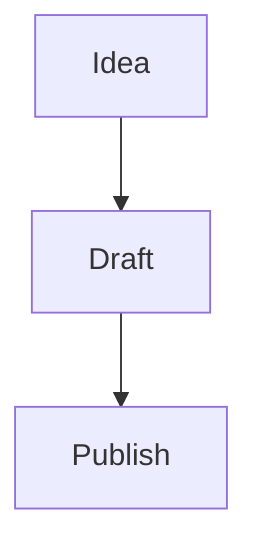

# Gitsidian

## Your notes. Your repo. Your rules.

Gitsidian is a free, open-source desktop app for writing and organising your notes — powered entirely by Git. No cloud accounts, no subscriptions, no proprietary formats. Just Markdown files in a repository you own.

Think of it as **Obsidian meets Git**, built from scratch with modern tools.

---

## Why Gitsidian?

Most note-taking apps lock you into their ecosystem. Your notes live on someone else's server, in someone else's format, behind someone else's paywall.

Gitsidian takes a different approach:

- **Your notes are plain Markdown files.** Open them in any editor, on any device, forever.
- **Your sync is Git.** Push to GitHub, GitLab, or your own server. You control where your data lives.
- **Your history is automatic.** Every commit is a snapshot. Revert any note to any point in time.
- **Your workflow is local-first.** Everything runs on your machine. No internet required to write.

No vendor lock-in. No monthly fee. No telemetry.

---

## What It Looks Like

Gitsidian is a native desktop app with a clean, dark interface built around three panels:

| Panel               | What it does                                                                          |
| ------------------- | ------------------------------------------------------------------------------------- |
| **Sidebar** (left)  | Browse files, search notes, manage Git, view tags, open daily notes, insert templates |
| **Editor** (centre) | Write in Markdown with live inline rendering — or switch to a full preview            |
| **Right panel**     | See your outline, backlinks, properties, file history, and knowledge graph            |

The editor renders your Markdown as you type. Headings grow to size, bold text appears bold, links become clickable, and checkboxes become interactive — all without leaving the editing view.

---

## Features

### Write naturally

The editor understands Markdown deeply. As you type, formatting appears inline:

- **Headings** render at their actual size. Move your cursor to a line to see the raw `#` markers.
- **Bold**, _italic_, ~~strikethrough~~, and ==highlights== display immediately.
- Code blocks get syntax-coloured backgrounds.
- Images render below their Markdown line.
- Horizontal rules become styled dividers.

Press **Ctrl+E** to switch to a fully rendered read-only preview whenever you want a distraction-free reading experience.

### Link your thinking

Connect ideas with `[[wikilinks]]`:

- Type `[[` and an autocomplete popup shows every note in your vault.
- Click any link to jump to that note instantly.
- Hover over a link to preview its content in a tooltip.
- Use `[[note|custom text]]` to display a different label.
- Embed another note's content inline with `![[note-name]]`.

The **Backlinks** panel shows you every note that links to the one you're reading — so you can trace ideas in both directions.

### Visualise your knowledge

The **Graph View** renders your entire vault as an interactive network:

- Each note is a node. Each wikilink is an edge.
- Node size scales with how many notes link to it.
- Click any node to open that note.
- Drag to rearrange. Scroll to zoom.

See the shape of your thinking at a glance.

### Git integration, built in

You don't need to leave the app to use Git. The sidebar has a dedicated **Git** tab:

- **See what changed** — modified, added, and deleted files appear with colour-coded status indicators.
- **Stage and commit** — click files to stage them, type a message, and commit.
- **Push and pull** — sync with your remote in one click.
- **Branch** — create and switch branches without touching the terminal.
- **File history** — see the full commit log for any note and view old versions.

If your vault isn't a Git repo yet, Gitsidian can initialise one for you.

### Daily notes

Press **Alt+D** (or click in the sidebar) to open today's daily note. If it doesn't exist, it's created automatically with a dated template including sections for tasks, notes, and journaling.

The sidebar shows your last seven days of daily notes for quick access.

### Templates

Create a `templates/` folder in your vault and add any `.md` files. Then:

- **Insert** a template's content at your cursor position in any note.
- **Create a new note** from a template with one click.

Templates support variables that auto-fill:

| Variable       | Becomes             |
| -------------- | ------------------- |
| `{{date}}`     | Today's date        |
| `{{time}}`     | Current time        |
| `{{datetime}}` | Full timestamp      |
| `{{title}}`    | The note's filename |

### Rich content

Gitsidian goes beyond basic Markdown:

**Callouts** — Obsidian-style admonitions for notes, warnings, tips, and more:

```
> [!tip] Pro tip
> Templates save you time every day.
```

Renders as a styled box with a coloured border and icon. 15 types supported: note, tip, info, warning, danger, bug, example, quote, abstract, todo, success, question, failure, caution, important.

**Math** — LaTeX equations powered by KaTeX:

```
Inline: $E = mc^2$

Block:
$$
\int_{-\infty}^{\infty} e^{-x^2} dx = \sqrt{\pi}
$$
```

**Diagrams** — Mermaid.js flowcharts, sequence diagrams, Gantt charts, and more:

````

````

**Interactive checkboxes** — Task lists you can click to toggle:

```
- [ ] Write the docs
- [x] Ship the feature
```

**Tables** — Full markdown table rendering with column alignment:

```
| Feature   | Status |
| :-------- | :----: |
| Auto-save |   ✅   |
| Tables    |   ✅   |
```

**Image paste** — Paste an image from your clipboard (`Ctrl+V`) and it’s automatically saved to `attachments/` with a markdown link inserted at your cursor. No manual file management needed.

### Search everything

- **Command palette** (`Ctrl+P`) — fuzzy-search all note names instantly. If the note doesn't exist, pressing Enter creates it.
- **Full-text search** — powered by Tantivy, a Rust search engine. Finds content across every note with ranked results and highlighted snippets.

### Tags and properties

Organise with hashtags anywhere in your text (`#project`, `#idea`) or in YAML frontmatter. The **Tags** panel in the sidebar shows all tags with counts.

The **Properties** panel gives you a visual editor for YAML frontmatter — add, edit, and remove key-value metadata without touching raw YAML.

### File management

- **Drag and drop** files between folders.
- **Right-click context menus** for rename, delete, star, and create.
- **Star** your most-used notes for quick access at the top of the file tree.
- **Nested folders** — create any folder structure you need.
- **Auto-save** — your work is saved automatically after 2 seconds of inactivity. No more lost changes.
- **Safe delete** — confirmation dialog before deleting files. Close a tab with unsaved changes and you’ll be prompted to save.

---

## Keyboard Shortcuts

| Shortcut       | Action                  |
| -------------- | ----------------------- |
| `Ctrl+S`       | Save                    |
| `Ctrl+P`       | Command palette         |
| `Ctrl+E`       | Toggle source / preview |
| `Ctrl+B`       | Toggle right panel      |
| `Alt+D`        | Today's daily note      |
| `Ctrl+F`       | Find in file            |
| `Ctrl+H`       | Find and replace        |
| `Ctrl+Z`       | Undo                    |
| `Ctrl+Shift+Z` | Redo                    |

---

## How It Works

Gitsidian is a native desktop application — not a web app, not an Electron wrapper.

**Frontend:** React 19 with TypeScript, running in a lightweight webview. The editor is CodeMirror 6 with 10 custom extensions for live preview, wikilinks, autocomplete, math, diagrams, callouts, and more. State is managed with Zustand. The graph is rendered with Cytoscape.js.

**Backend:** Rust, compiled natively for your platform. Git operations use libgit2 (via the git2 crate) for reliable, fast version control. Full-text search is powered by Tantivy, a Rust search engine inspired by Lucene. File watching uses the notify crate for instant updates when files change on disk. Markdown parsing uses comrak.

**Desktop shell:** Tauri 2 bridges the frontend and backend with a tiny footprint — no bundled Chromium, no Node.js runtime. The result is a fast, lightweight app that starts in under a second.

Your vault is just a folder on your filesystem. Gitsidian reads and writes plain `.md` files. Nothing is stored in a database. Nothing is uploaded anywhere. If you delete Gitsidian, your notes are still right where you left them.

---

## Getting Started

### 1. Install

**Prerequisites:**

- [Node.js](https://nodejs.org) 18+
- [Rust](https://rustup.rs) 1.77+
- Windows: [Visual Studio Build Tools 2022](https://visualstudio.microsoft.com/visual-cpp-build-tools/) with the "Desktop development with C++" workload

```bash
git clone https://github.com/your-username/gitsidian.git
cd gitsidian
npm install
```

### 2. Run

```bash
npx tauri dev
```

The app opens in a native window. Hot-reload is enabled — changes to the UI appear instantly.

### 3. Open a vault

Click **Open Vault** and select any folder. If it's already a Git repo, Git features activate automatically. If not, you can initialise one from the Git panel.

### 4. Start writing

Click the **+** button in the sidebar or press **Ctrl+P** and type a name to create your first note. Start writing in Markdown — the editor handles the rest.

### 5. Build for production

```bash
npx tauri build
```

Produces a native installer for your platform.

---

## Tech Stack

| Layer         | Technology     | Why                                                |
| ------------- | -------------- | -------------------------------------------------- |
| Desktop shell | Tauri 2        | Native performance, tiny bundle, no Electron bloat |
| UI framework  | React 19       | Component-driven, fast rendering                   |
| Editor        | CodeMirror 6   | Extensible, performant, modern editor toolkit      |
| Type safety   | TypeScript 5   | Catch bugs before they ship                        |
| Build tool    | Vite 7         | Instant HMR, fast builds                           |
| State         | Zustand 5      | Minimal, flexible state management                 |
| Graph         | Cytoscape.js   | Battle-tested graph visualisation                  |
| Math          | KaTeX          | Fast LaTeX rendering                               |
| Diagrams      | Mermaid        | Declarative diagrams from text                     |
| Git           | git2 (libgit2) | Native Git operations in Rust                      |
| Search        | Tantivy        | Blazing-fast full-text search                      |
| Markdown      | comrak         | CommonMark + extensions parsing                    |
| File watching | notify         | Cross-platform filesystem events                   |
| Async         | tokio          | Rust async runtime                                 |

---

## Philosophy

1. **Local first.** Your files live on your machine. You choose if and where to sync them.
2. **Plain text.** Markdown is the format. No proprietary schemas, no binary blobs.
3. **Git native.** Version control isn't a feature bolted on — it's the foundation.
4. **Fast and light.** Native Rust backend, no bundled browser engine, sub-second startup.
5. **Open source.** MIT licensed. Read the code, fork it, make it yours.

---

## FAQ

**Is this a replacement for Obsidian?**
It's inspired by Obsidian but takes a different approach. Where Obsidian uses its own sync service, Gitsidian uses Git. Where Obsidian has a plugin ecosystem, Gitsidian has the features built in. If you want your notes in a Git repo with no extra setup, Gitsidian is for you.

**Does it work with existing Obsidian vaults?**
Yes. Gitsidian reads standard Markdown files and supports Obsidian-flavoured syntax including wikilinks, callouts, and frontmatter. Point it at your existing vault folder.

**What platforms does it support?**
Windows, macOS, and Linux — anywhere Tauri 2 runs.

**Is it free?**
Yes. MIT licensed, free forever.

**Where is my data stored?**
On your filesystem, in the folder you choose. Gitsidian doesn't store data anywhere else. Push to a remote Git repo if you want backups or sync.

**Can I use it offline?**
Absolutely. Everything works offline. Git push/pull requires internet, but writing, searching, and organising are fully local.

**How is it different from VS Code + Markdown?**
Gitsidian is purpose-built for note-taking. It has wikilinks, backlinks, a knowledge graph, daily notes, templates, callouts, and a live preview that VS Code doesn't offer out of the box. It's also much lighter than VS Code.

---

## License

MIT — free to use, modify, and distribute.
