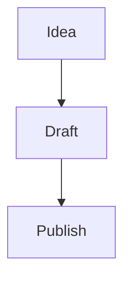

# CommitPaper

## Your notes. Your folder. Your rules.

CommitPaper is a free, open-source web app for writing and organising your notes — right in your browser. No cloud accounts, no subscriptions, no proprietary formats. Just Markdown files in a folder you own. Add Git for version history and cross-device sync.

Think of it as **Obsidian meets your filesystem**, running right in your browser.

---

## Why CommitPaper?

Most note-taking apps lock you into their ecosystem. Your notes live on someone else's server, in someone else's format, behind someone else's paywall.

CommitPaper takes a different approach:

- **Your notes are plain Markdown files.** Open them in any editor, on any device, forever.
- **Your vault is just a folder.** Pick any folder on your computer. No special setup required.
- **Git is optional but powerful.** Add Git for version history, cross-device sync via GitHub/GitLab, and the ability to revert any note to any point in time.
- **Your workflow is local-first.** Everything runs on your machine. No internet required to write.

No vendor lock-in. No monthly fee. No telemetry.

---

## What It Looks Like

CommitPaper is a web app with a clean, dark interface built around three panels:

| Panel               | What it does                                                                          |
| ------------------- | ------------------------------------------------------------------------------------- |
| **Sidebar** (left)  | Browse files, search notes, manage Git, view tags, open daily notes, insert templates |
| **Editor** (centre) | Write in Markdown with live inline rendering — or switch to a full preview            |
| **Right panel**     | See your outline, backlinks, properties, file history, and knowledge graph            |

The editor renders your Markdown as you type. Headings grow to size, bold text appears bold, links become clickable, and checkboxes become interactive — all without leaving the editing view.

---

## Features

### Write naturally

The editor understands Markdown deeply. As you type, formatting appears inline:

- **Headings** render at their actual size. Move your cursor to a line to see the raw `#` markers.
- **Bold**, _italic_, ~~strikethrough~~, and ==highlights== display immediately.
- Code blocks get syntax-coloured backgrounds.
- Images render below their Markdown line.
- Horizontal rules become styled dividers.

Press **Ctrl+E** to switch to a fully rendered read-only preview whenever you want a distraction-free reading experience.

### Link your thinking

Connect ideas with `[[wikilinks]]`:

- Type `[[` and an autocomplete popup shows every note in your vault.
- Click any link to jump to that note instantly.
- Hover over a link to preview its content in a tooltip.
- Use `[[note|custom text]]` to display a different label.
- Embed another note's content inline with `![[note-name]]`.

The **Backlinks** panel shows you every note that links to the one you're reading — so you can trace ideas in both directions.

### Visualise your knowledge

The **Graph View** renders your entire vault as an interactive network:

- Each note is a node. Each wikilink is an edge.
- Node size scales with how many notes link to it.
- Click any node to open that note.
- Drag to rearrange. Scroll to zoom.

See the shape of your thinking at a glance.

### Git awareness (optional)

If your vault is a Git repo, CommitPaper reads your Git status directly from the filesystem:

- **See your branch** — the current branch name is read from `.git/HEAD` and displayed in the sidebar and status bar.
- **Modified file count** — see how many files have been changed at a glance.
- **Terminal guidance** — the Git panel shows the commands you need to commit and push from your terminal.

Git is not required — CommitPaper works perfectly well with any regular folder. But if you want version history or cross-device sync, initialising a Git repo in your vault gives you both.

For full Git operations (commit, push, pull, branch), use your terminal or favourite Git client alongside CommitPaper.

### Daily notes

Press **Alt+D** (or click in the sidebar) to open today's daily note. If it doesn't exist, it's created automatically with a dated template including sections for tasks, notes, and journaling.

The sidebar shows your last seven days of daily notes for quick access.

### Templates

Create a `templates/` folder in your vault and add any `.md` files. Then:

- **Insert** a template's content at your cursor position in any note.
- **Create a new note** from a template with one click.

Templates support variables that auto-fill:

| Variable       | Becomes             |
| -------------- | ------------------- |
| `{{date}}`     | Today's date        |
| `{{time}}`     | Current time        |
| `{{datetime}}` | Full timestamp      |
| `{{title}}`    | The note's filename |

### Rich content

CommitPaper goes beyond basic Markdown:

**Callouts** — Obsidian-style admonitions for notes, warnings, tips, and more:

```
> [!tip] Pro tip
> Templates save you time every day.
```

Renders as a styled box with a coloured border and icon. 15 types supported: note, tip, info, warning, danger, bug, example, quote, abstract, todo, success, question, failure, caution, important.

**Math** — LaTeX equations powered by KaTeX:

```
Inline: $E = mc^2$

Block:
$$
\int_{-\infty}^{\infty} e^{-x^2} dx = \sqrt{\pi}
$$
```

**Diagrams** — Mermaid.js flowcharts, sequence diagrams, Gantt charts, and more:

````

````

**Interactive checkboxes** — Task lists you can click to toggle:

```
- [ ] Write the docs
- [x] Ship the feature
```

**Tables** — Full markdown table rendering with column alignment:

```
| Feature   | Status |
| :-------- | :----: |
| Auto-save |   ✅   |
| Tables    |   ✅   |
```

**Image paste** — Paste an image from your clipboard (`Ctrl+V`) and it’s automatically saved to `attachments/` with a markdown link inserted at your cursor. No manual file management needed.

### Search everything

- **Command palette** (`Ctrl+P`) — fuzzy-search all note names instantly. If the note doesn't exist, pressing Enter creates it.
- **Full-text search** — powered by MiniSearch, a client-side search engine. Finds content across every note with ranked results and highlighted snippets.

### Tags and properties

Organise with hashtags anywhere in your text (`#project`, `#idea`) or in YAML frontmatter. The **Tags** panel in the sidebar shows all tags with counts.

The **Properties** panel gives you a visual editor for YAML frontmatter — add, edit, and remove key-value metadata without touching raw YAML.

### File management

- **Drag and drop** files between folders.
- **Right-click context menus** for rename, delete, star, and create.
- **Star** your most-used notes for quick access at the top of the file tree.
- **Nested folders** — create any folder structure you need.
- **Auto-save** — your work is saved automatically after 2 seconds of inactivity. No more lost changes.
- **Safe delete** — confirmation dialog before deleting files. Close a tab with unsaved changes and you’ll be prompted to save.

---

## Keyboard Shortcuts

| Shortcut       | Action                  |
| -------------- | ----------------------- |
| `Ctrl+S`       | Save                    |
| `Ctrl+P`       | Command palette         |
| `Ctrl+E`       | Toggle source / preview |
| `Ctrl+B`       | Toggle right panel      |
| `Alt+D`        | Today's daily note      |
| `Ctrl+F`       | Find in file            |
| `Ctrl+H`       | Find and replace        |
| `Ctrl+Z`       | Undo                    |
| `Ctrl+Shift+Z` | Redo                    |

---

## How It Works

CommitPaper runs entirely in your browser using the **File System Access API**.

**Frontend:** React 19 with TypeScript. The editor is CodeMirror 6 with 10 custom extensions for live preview, wikilinks, autocomplete, math, diagrams, callouts, and more. State is managed with Zustand. The graph is rendered with Cytoscape.js.

**File Access:** The browser's File System Access API lets CommitPaper read and write files directly on your filesystem — no server needed. You pick a folder, grant permission, and CommitPaper works with your files directly.

**Search:** Client-side full-text search powered by MiniSearch, with fuzzy matching and ranked results.

**Offline:** CommitPaper is a Progressive Web App. Once loaded, it works fully offline.

Your vault is just a folder on your filesystem. CommitPaper reads and writes plain `.md` files. Nothing is stored in a database. Nothing is uploaded anywhere. If you stop using CommitPaper, your notes are still right where you left them.

---

## Getting Started

### 1. Install

**Prerequisites:**

- [Node.js](https://nodejs.org) 18+

```bash
git clone https://github.com/IainMcl/commitpaper.git
cd commitpaper
npm install
```

### 2. Run

```bash
npm run dev
```

Opens at [http://localhost:5180](http://localhost:5180). Hot-reload is enabled.

### 3. Open a vault

Click **Open Vault** and select any folder. Your browser will ask for read/write permission. If the folder is a Git repo, the Git panel shows your branch and modified files.

### 4. Start writing

Click the **+** button in the sidebar or press **Ctrl+P** and type a name to create your first note. Start writing in Markdown — the editor handles the rest.

### 5. Build for production

```bash
npm run build
```

Produces a static site in `dist/`. Deploy to any web server.

---

## Tech Stack

| Layer        | Technology             | Why                                           |
| ------------ | ---------------------- | --------------------------------------------- |
| UI framework | React 19               | Component-driven, fast rendering              |
| Editor       | CodeMirror 6           | Extensible, performant, modern editor toolkit |
| Type safety  | TypeScript 5           | Catch bugs before they ship                   |
| Build tool   | Vite 7                 | Instant HMR, fast builds                      |
| State        | Zustand 5              | Minimal, flexible state management            |
| Graph        | Cytoscape.js           | Battle-tested graph visualisation             |
| Math         | KaTeX                  | Fast LaTeX rendering                          |
| Diagrams     | Mermaid                | Declarative diagrams from text                |
| Search       | MiniSearch             | Client-side full-text search                  |
| File access  | File System Access API | Direct filesystem read/write in the browser   |
| PWA          | vite-plugin-pwa        | Offline support and installability            |

---

## Philosophy

1. **Local first.** Your files live on your machine. You choose if and where to sync them.
2. **Plain text.** Markdown is the format. No proprietary schemas, no binary blobs.
3. **Git ready.** Add Git for version history and sync — or don't. It's your choice.
4. **Fast and light.** No backend server, no bundled browser engine, instant startup.
5. **Open source.** MIT licensed. Read the code, fork it, make it yours.

---

## FAQ

**Is this a replacement for Obsidian?**
It's inspired by Obsidian but takes a different approach. CommitPaper works with any folder on your computer and optionally integrates with Git for version history and sync. Where Obsidian has a plugin ecosystem, CommitPaper has the features built in. If you want a lightweight, local-first note app that works with plain Markdown files, CommitPaper is for you.

**Does it work with existing Obsidian vaults?**
Yes. CommitPaper reads standard Markdown files and supports Obsidian-flavoured syntax including wikilinks, callouts, and frontmatter. Point it at your existing vault folder.

**Do I need Git?**
No. CommitPaper works with any folder — Git is entirely optional. But if you want version history or to sync your notes across computers, initialising a Git repo in your vault is a great way to get both.

**What browsers are supported?**
Chrome 86+ and Edge 86+ (requires the File System Access API). Firefox and Safari are not currently supported.

**Is it free?**
Yes. MIT licensed, free forever.

**Where is my data stored?**
On your filesystem, in the folder you choose. CommitPaper doesn't store data anywhere else. Nothing is uploaded. Nothing leaves your browser.

**Can I use it offline?**
Absolutely. Once loaded, CommitPaper works fully offline as a Progressive Web App. Writing, searching, and organising are fully local.

**Can I commit and push from CommitPaper?**
Not directly — browsers can't run Git operations. If your vault is a Git repo, the Git panel shows your branch and modified files, then guides you to use your terminal for commits and pushes.

**How is it different from VS Code + Markdown?**
CommitPaper is purpose-built for note-taking. It has wikilinks, backlinks, a knowledge graph, daily notes, templates, callouts, and a live preview that VS Code doesn't offer out of the box. It's also much lighter than VS Code.

---

## License

MIT — free to use, modify, and distribute.
